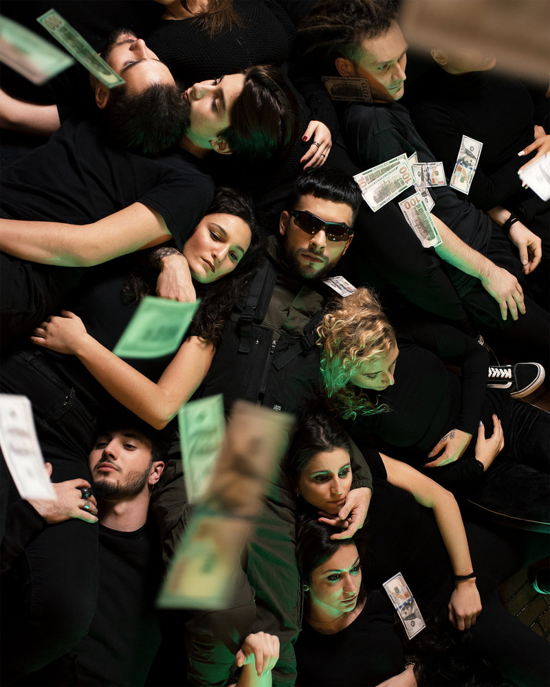

An interview with the musical artist based in London.

Introducing Luke ATME, an upcoming musical artist with a growing resume of several accolades. He first started his career at 14 years old with cover music, mainly with an online audience. While in school, he participated in his hometown's  dance crew, which competed at Nationals. Additionally, he performed locally, showcasing both of his artistic abilities–song and dance.

Luke ATME graduated in 2017 from  the University of West London with a degree in music performance. In 2018, he launched "Loudest!", his first EP led by the track "Higher" to his UK audience.

As of 2019, Luke has obtained several accolades including awards from AAA4Success Award for “Artist of the Year”, a Golden Award for “Song of the Year” for his Spanish single “Perdóname",  and the Golden Award for “Artist of the Year".

Check out his [new single on Spotify](https://open.spotify.com/album/3pjzw1BejmVBNmIwqRobyj?si=hgIcVmCnSjSPejElMWzPwQ):

<iframe src="https://open.spotify.com/embed/track/1170TRghloqZlL6isoB4tq" width="300" height="380" frameborder="0" allowtransparency="true" allow="encrypted-media"></iframe>

#### Hi, glad to have you! Please introduce yourself!

Hey there, happy to be talking to you! I’m Luke ATME, an artist from Italy, living in London but travelling the States at the moment. I started out with EDM/Pop music, then I moved into the reggaeton latin scene as people often consider me latin, but my last song which I’m currently promoting, is hip hop, something completely new!

#### When did you start making music? What does the creative process offer you?

I started working on music from an early age, I was probably 12. At the time I did not actually make music, like I have always had this innate power of creating melodies in my head and singing them loud, then make up lyrics from it, but the first proper song I wrote was a tune titled “Get the Freedom” with a DJ from my hometown, and I was probably 17 back then. I am very creative and I love the songwriting process, that’s probably one of the parts I like the most about music, I usually go into the studio already with an idea of what I want to do or at least having a genre in mind, then I work with my producer, we decide the chords, he starts inserting instruments and the beat, at the same time I write down some lyrics and think of melodies that might work with the mood. Sometimes I come up straight away with a very great sentence with a nice melody, other times I just write down key words and then put them together into statements.

#### Which songs or series are you most proud of and why?

I would say my last song “Cash Checks ATM” is the one I’m more proud of, I mean I am totally into that vibe right now, I wrote something super real, very close to the everyday life, it’s a bit more personal and fierce but I love it, and I hope you do too! Also the video of it, we’ve spent 2 full days working on the scenes and it was very challenging but I think the result is worth it. “Cuidado” as well is probably the other song I wrote which I’m very proud of, it’s in Spanish and it’s a sort of warning song, like telling people who try to play with me, to be careful cause I can play better than them… it’s very straight forward but it’s also a bit slow down, like a pop/reggaeton ballad I would say.

#### Is there a story behind one of your works you would like to share?

Okay so let’s say that every work of mine has a story behind ahahaha, but cause I’m here to talk about my last song, I will stick to that one. When I firstly got into the studio to record “Cash Checks ATM”, I was with Paddy (the producer) and I told him “I want to rap, I want to make something that I never did before, something that can work very well with what people are listening to, and I want to write about money, something people can relate to, but also I want to talk about my life”. So I started writing and the first verse came very fast, it starts as a continuation from “Cuidado” cause I sing “Said to you the other day, be careful with who you play” and that’s what I say in the chorus of the previous song I released a few months earlier. I do a list about all the jobs I changed to invest on my music, to pay my bills, my university, how hard it was to go to uni, then go to work till late and at night studying for my music exams, it was tough and I just put out all what I did not say until now. In the second verse I explicitly give a price to myself affirming that I won’t do anything else for free and I also make a citation to “Blank Space” from Taylor Swift when I sing “Nice to meet you, where you been? I can show you incredible things”, cause she’s such a great inspiration for me, especially for the songwriting skills she has. For the music video instead I just wanted cash as key element for all the scenes, and we had us dollars in the pool, in the kitchen, I was eating a pile of money, that was a lot of fun and I hope you liked the final result!

#### What would you say is your main source of inspiration?

I think travelling surely helps me a lot as a source of inspiration. I get inspired a lot when I travel, when I meet new cultures, new people, learn a new language, new food. Maybe because when I travel I tend more to go out, motivated to see new places, learn the lifestyle of that city, so I live more experiences. Then when I’m home I resemble all I’ve experienced and I write down songs.

#### What are your favorite artist tools?

The fact that I’m a dancer too and I love to combine my music with choreography and movements, that can be my favourite artist tool. I mean when I write a new song I always start thinking of a choreo and also of ideas for the music video, even if it doesn’t always go the way I first thought of lol. But yeah I love the creativity of it, and I like this tool of mine, to be very creative, sometimes I have so many ideas that I gotta cut some off. Also another tool I like is that I can write songs in different languages, so usually based on the genre I pick, I then decide the language I want to sing in, evaluating the one that might sound better or easier to write in related to the topic.

#### What does your workflow look like?

My workflow is crazily unstoppable. I finished university 2 years ago and since then I started writing a lot of music, I try to pick up the songs I want to release, then create the music video, work on a promotion plan and so on. At the same time I work with my dancers, go to dance class, model part time with an agency and take part in some series and small TV shows when I get the chance and have time for it! I try to do the best I can, some work pays me well some others I just do to get visibility and get engaged in different environments. But I hope my workflow stays always very active, I prefer having a lot to do rather than laying on a sofa the whole day, if you know what I mean. I like to see cash getting into my bank account lol.