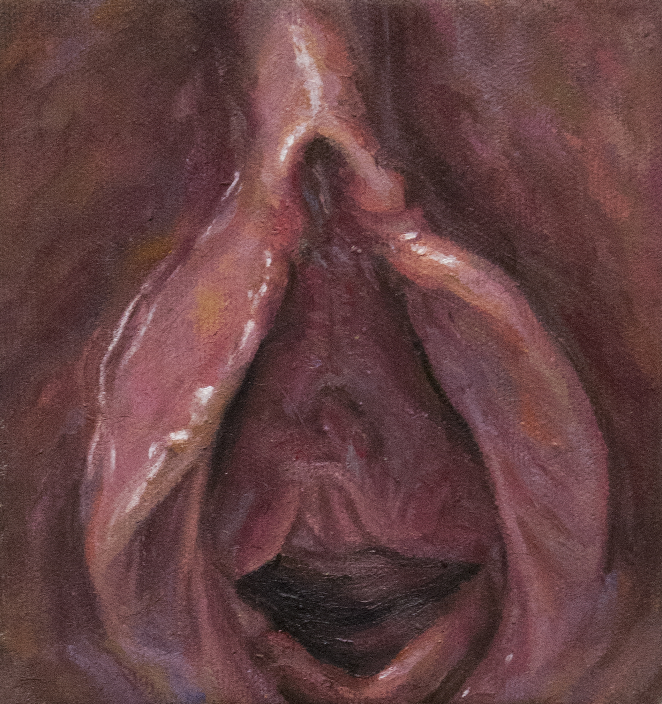

Note: This interview is intended for mature audiences and is not safe for work (NSWF). 
Introducing the artist, Armando Cabba who is currently based in Paris. 

He is known for his duality of portraiture and abstract art, though he ventures into other styles as well. 

#### How did this series come to life?  
  
It all began a year ago with the first painting Resurrection of Christ by Raphael . I imagine Tumblr is going to flag the image, but it’s a close up of a vagina. I didn’t wake up one day deciding “I’m going to paint tits n bits because I’m living la vida loca” The idea began with the infamous Tumblr ban on adult content and how they directly said “female presenting nipples” as their main example. It’s a bunch of corporate bullsh*t that didn’t solve any problem and did more damage than good. So I decided to do what I do best and that’s being a creative pain in the ass resulting in these paintings being born and being available on Instagram and other social media platforms despite the rules.  

*Resurrection of Christ* 

#### Why give them titles of religious paintings from the Renaissance? 

Why not? I think it’s funny. Knowing there’s some old art historian who is trying to google whatever musty old Italian painting and finds a painting of oiled up balls instead is hilarious to me. Enjoy the simple things in life.  
  
On a more serious note, If there’s one common thing to know regarding online censorship, if it has any relation to Christianity, it’s going to fly. Putting hashtags like #jesus , #thebible , etc will stay up because no one wants to forbid any preaching regarding that god. It’s a form of supremacy at the end of the day because if I would use any religion that’s not practiced by mainly white people, it be over in a heartbeat. If you’re making a frown and don’t understand the link I’m making regarding Jesus and white supremacy, just look at any history book. We had lunatics running around the desert wearing toaster helmets and red crosses killing Muslims in the name of God. We “converted” how many indigenous people since Columbus showed up? Mainstream Christianity will never be censored which allows hate speech spread from extremists groups like the KKK and Westboro Baptist church. I’ve figured out how to use it to get my paintings out there and also to annoy whatever conservative might be on the other end of the screen.

*Baptism of Christ* 

#### Regarding the subject of online censorship, why is this an important issue to you?

Censorship is a global issue. Look at how we get 0 coverage regarding protests and catastrophes that aren’t happening in 1st world western based countries. When Tumblr created their ban, it didn’t solve the problem regarding spam accounts, child porn, and neo nazi blogs because they’re still there. It hurt artists and sex workers who created a space for their work to be seen. It acted as a modern day witch hunt. Women were the victims of this due to corporate decisions and they are still wrestling with the consequences. Instagram shadow bans accounts of POC and/or LGBTQI+ and/or sex workers all the time. God forbid we should normalize people outside of white bread beauty standards, embrace different perspectives of sexuality, and consider sex work as real work. It’s a form of oppression. 

#### You’ve mentioned race, will you begin to include images of POC?

You’re not the first to ask that and it’s a great question. I’ve been hesitant because of the subject matter of why this work came to be and my place as an artist. As a white cis male, who am I to tell certain stories? There are plenty of amazing artists who are doing this and have been doing it way before me like Rafia Santana, Betty Tompkins, and Joan Semmel. So where do I come into play as an artist going after online censorship with erotic images? From my perspective, there’s a very thin line between inclusion and fetishizing a race or when it comes to interpreting this body of work. There’s a huge part of me screaming for diversity when I work on this series and I’m aware the images are unrealistic standards set up by mainstream porn. We have to be conscious of sites that push specific content. It’s either incest based narratives or racially driven sexual novelties for white consumption featured on the homepage. So back to art and the origins of my series, if I paint POC does that mean I’ve transformed their sexuality into a tool against a higher authority? How does race now play into religion and sex? If I cross into this territory, what are my limitations? These are questions I ask myself. There’s a lot of artists, specifically male, that don’t ask themselves anything or run ideas by people around them. I’m 100% for more diversity but the big question is “Just because I’m capable, does it mean I should?” If you want to see more of that content, it’s out there and go support those artists and hear their stories. I feel at this point in time I still need to do more research and avoid making mistakes that’ll make the problem bigger than it already is. We’ll see how this series evolves. So I guess I’ll get back to you on that one.

#### From your perspective, why do you think there’s a negative reaction to women expressing their sexuality?

I think people misinterpret someone’s sexual expression as sexual availability. Just because you see someone posting revealing photos on your feed, that doesn’t translate to them inviting you into their DMs or them wanting to have sex with you. That’s one issue I’ve witnessed first hand regarding my friends sharing their stories and experiences on social media. Men over time have dictated a woman’s worth based on their physical beauty. Women figured out they can turn that into currency and men get pissed off about it. If you think I’m being outrageous, look at all the instances of men calling the IRS on women who make money off of their bodies using things like Snapchat. The amount of forums that are dedicated to leaked content because people would rather steal than support that person’s work. It’s frustrates people when they believe things are catered to them and they find out it has 0 to do with them or they’re denied, they get upset. Regardless of how far we’ve come on the gender equality front, unfortunately women are still considered objects either consciously or not and the majority of men have not unlearned that.

*Martyrdom of St. Agatha* 

#### How has your audience reacted to your series?

Honestly, I’ve received tons of positive feedback from everyone. To have individuals message me and share ideas and thoughts is great. People enjoy it for their own reasons and what more can I ask for? There’s two groups of people that have been upset. We have the bible thumping Trump supporters and confused straight guys. I really don’t pay much mind to that batch of people. What’s Karen-Louise going to do? Ask to speak to my manager? You take what you want from the series. It’s your experience. 

#### What’s the primary message you want to get across with these paintings at the end of the day?

If you see my work online and you ask yourself “How the hell did this end up on my feed?” “Why is this allowed?” then you’re asking the right questions. I want the viewer to wonder why paintings referenced from mainstream porn are being posted on Instagram. Don’t expect an answer in a matter of seconds. Engage your mind a bit and question the system and understand there’s a problem. 

*Lamentation of Christ* 

For more information and to see more of Armando Cabba’s work, visit his website http://www.armando-cabba.com/