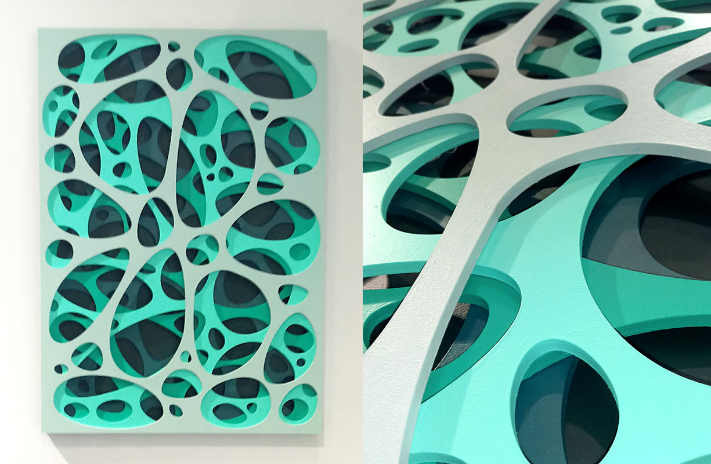
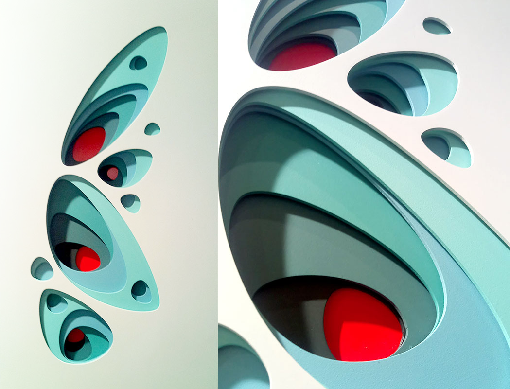
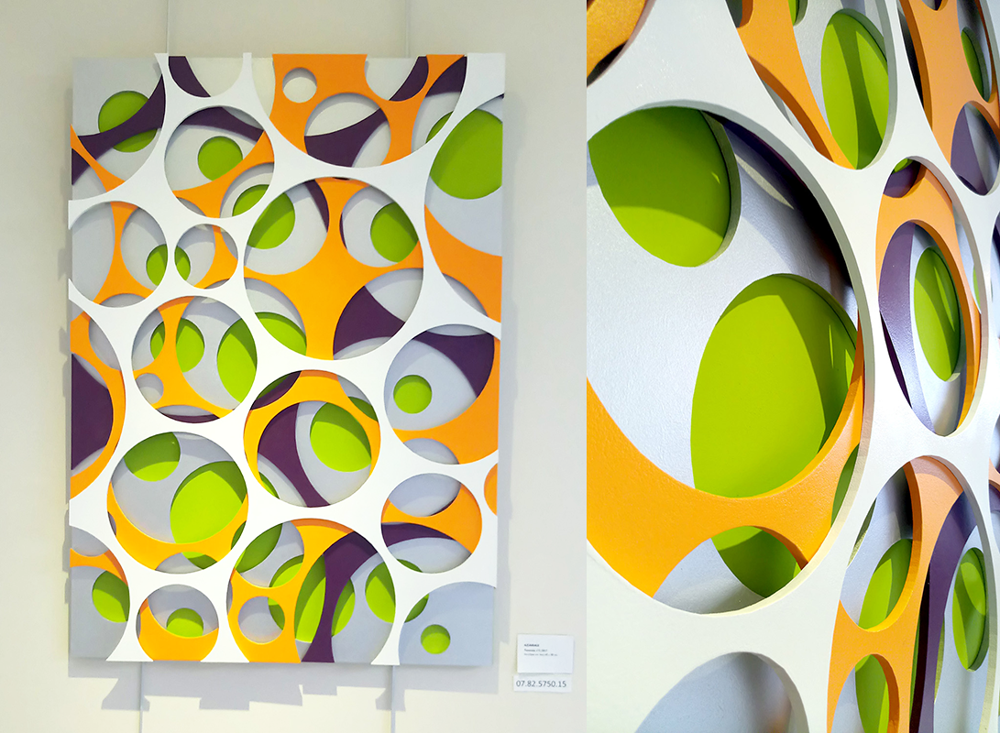
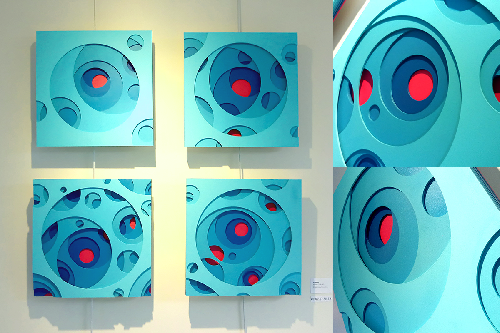

An interview with the talented artist from France, Azarias! 

**Hi, glad to have you! Please introduce yourself**
  
>Hi, thanks for having me here. My name is Azarias and I'm an artist based in the north of France, in a city full of young and creative people called Lille, between Paris and Brussels.

>Find Azarias' gallery here:  [https://azarias-art.com/](https://azarias-art.com/ "https://azarias-art.com/")

  
**When did you start making art? What does art offer you?**  
  
>I felt the power of art from a very young age. I realised very soon that art was offering me an area of freedom like no others and I started to explore many art forms (music, painting, drawing, sculpture, photography, graffiti, digital art, writing, ...). I now focus on visual art but I recently presented a piece of performance with dancing, music and a digital installation. I never know where an idea will lead me and that's what amazes me everytime.

**Which piece or series are you most proud of and why? Is there a story behind it?**
  
>Like most artists would probably say, I guess my last pieces are what I'm most proud of. I currently work on a series I entitled "Traversées", a French word meaning crossing, journey (voyage), passage or traverse. Let me try to sum up the intricate but very inspiring path that led me to this series. It all started by reading an essay from the french novelist and essayist Philippe Forest in which he developed the idea that "the novel responds to the call of the Real, in other words, the impossible" (The real is a concept developed by the French psychoanalyst Jacques Lacan). This raised a lot of questions to me and I asked myself how I could respond to this impossible he had written about. And then I came up with this very simple answer : our senses (nature) and our reason (culture) are limited and to a certain point they are struggling. So art is an answer to this impossible: how do we manage these limits? how do we handle this conflict? And then I remembered a documentary about dimensions in mathematics. This documentary tried to describe a sphere in 4 dimensions. As our senses are limited to 3 dimensions, it's impossible to see this sphere as it is but only the projection of this sphere in 3 dimensions. How to make it obvious ? Let's imagine someone living in 2 dimensions. He's living on a flat surface, like a sheet of paper. Then a sphere (in 3 dimensions) crosses the plane. What does he see ? A circle growing then decreasing but it's impossible to see the whole sphere. He only sees slices of the sphere. I had my idea to represent the impossible : a painting made of layers as if each layer was a slice of the sphere crossing the flat surface. So I started to make these multi-layered laser cut wood paintings.  
  
>This little story shows two important things to me as an artist. First of all, ideas always come from a question I feel I have to answer. As Picasso said "I have a horror of people who speak about the beautiful. What is the beautiful? One must speak of problems in painting!". So it's very important to ask yourself the right questions. Second: art is always a matter of condensation. In this process, you see that ideas come from literature, psychoanalysis or mathematics and then you connect things in your own and unique way.

**What would you say is your main source of inspiration?**
  
>If you pay enough attention to the world around you, everything is a source of inspiration. But to not elude the question, I'd say that, for my current work, I have drawn ideas from spatialism and organic architecture. With that being said, my main sources of inspiration don't come from art but philosophy, ethnology, sociology or psychology as I mentioned before.

**What are your favorite artist tools? What does your workflow look like?** 
  
>My most valuable tool is definitely my sensibility. But don't be sensitive or emotional, it's a romantic trap a lot of artists fall into. As I said before, if you open up to the world around you, you'll be ready to respond to subtle stimuli that most of the people might not even notice.

**What are some pieces of advice you have for other artists?**  
  
>Work everyday, work a lot, educate yourself (go out to exhibitions, read books, watch movies, ...), never dread what people think about your work because if it's good enough, people will see things you didn't even think about and ... work everyday!

