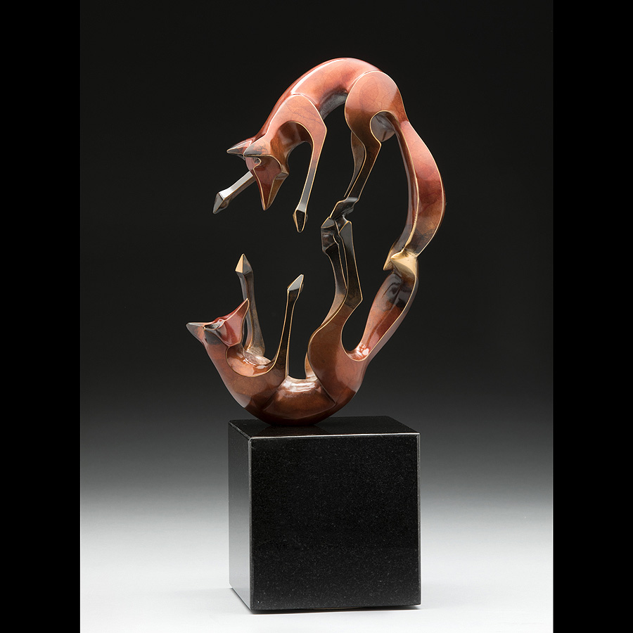
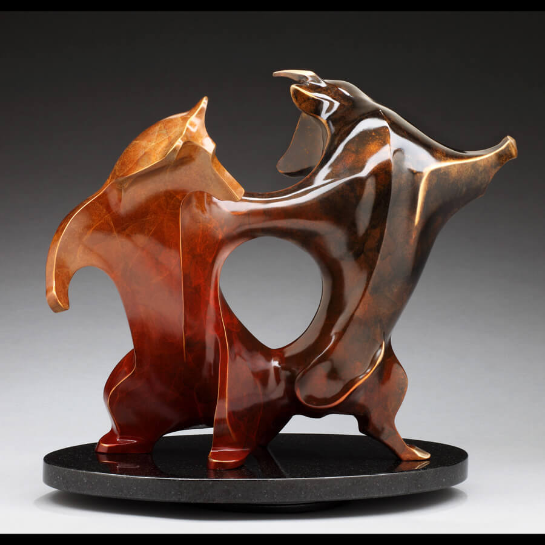
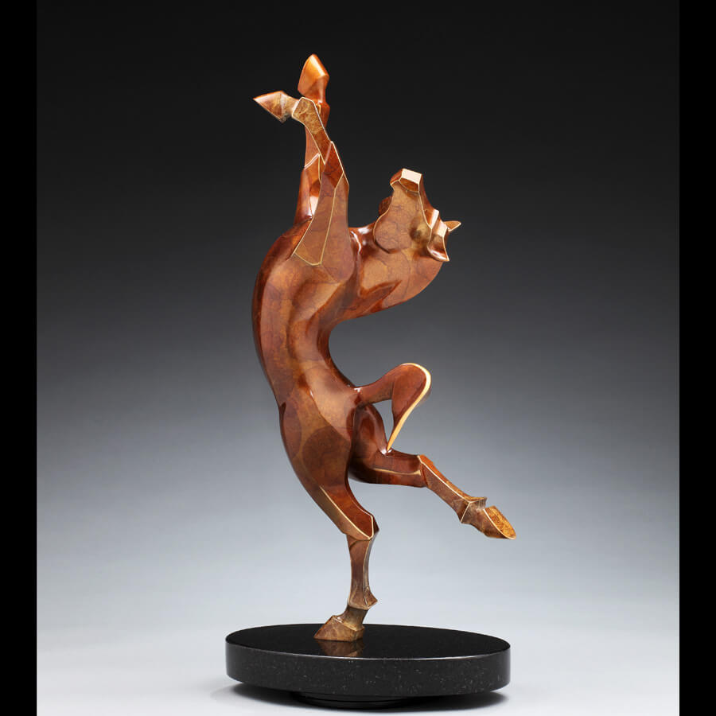
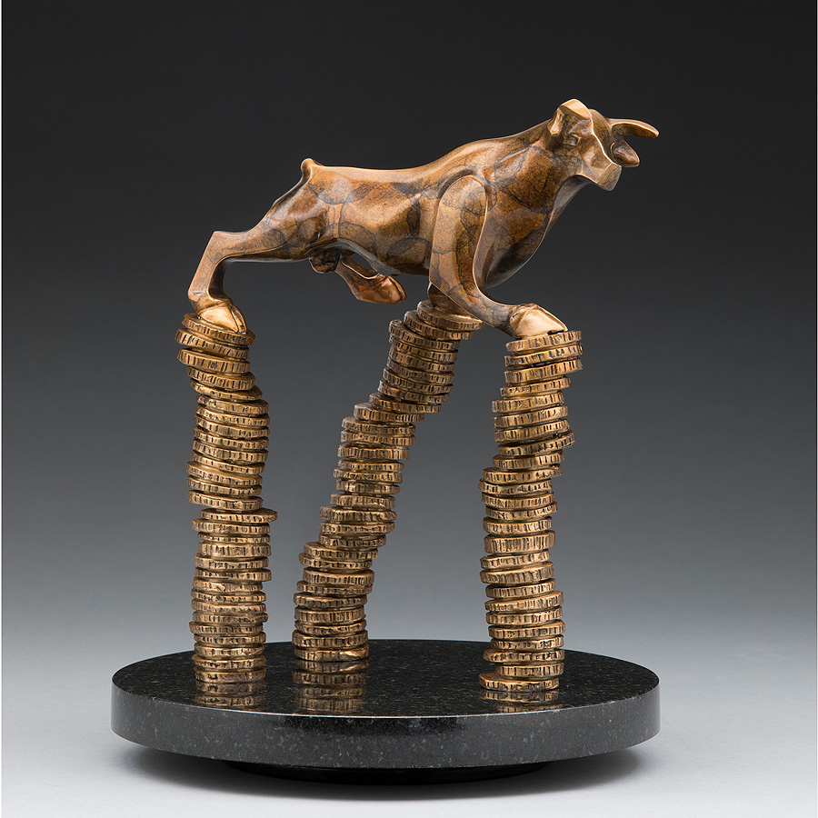

Artist Interview with the sculptor Laurel Peterson Gregory, based in Denver, CO.

##### Hi, glad to have you! Please introduce yourself!

> Greetings! My name is Laurel Peterson Gregory I create uplifting stylized bronze animal sculptures. My range of expression is enabled by a comprehensive skill set gained from extensive life experience. After earning a degree in Industrial Arts from Humboldt State University in Northern California, I came to my art in a roundabout way: mechanic, Master Electrician, building official, animal sculpture artist. From design to production, there is little that I can’t do to realize my visions.
>
> When I’m not in the studio, I can usually be found in the 10 large gardens with which I’ve surrounded my home and converted barn in the foothills of the Front Range south of Denver.
>
> My [bronze animal sculptures](https://laurelpetersongregory.com/desk-buddies/) have received multiple awards and are represented by galleries across the United States. I have fulfilled numerous private, corporate, and public commissions.

 

##### When did you start making art?

> My sculptures are my megaphone to the world. I don't see it simply as a profession, I believe crating my sculptures are my life's purpose. Since I became a professional artist later on in my life I have buckets of life experience to express thru my art When folks are drawn to my work  I see them connecting not only to the beauty of the piece, but also to the story and emotional content. My pieces evoke a variety of emotional and intellectual experiences from joy and laughter to stillness and mystery.

 

##### Which piece or series are you most proud of and why? Is there a story behind it?

> I have a few pieces that I am extremely proud of. The first one that comes to mind is "Ode To Joy". For quite some time I had been wanting to create a sculpture that would do justice to the powerful and majestic horse. I also knew I wanted to create a piece that would exude joy, arms lifted and heart to the heavens. I put the two together and designed "Ode To Joy".
>
> _Ode to Joy_, is a wonderful culmination of the hallmarks of my style. It pretty much has it all: The concave and convex curves, conscious use of planes and volumetric mass, movement highlighted by dimensional lines, balance, and realistic proportions. And, of course, a ton of emotion. Although treated with my unique brand of minimalism, breeders and trainers have been struck by the horse’s anatomical accuracy.
>
> **More than 140 hours** of sculpting went into this very happy bronze horse. It was a challenge, but well worth the effort.
>
> My strong intention in designing the statue was that it would be truly unique and not just as another rearing horse. As it turns you can see all of the sensuous and graceful curves that express the movement and strength required for the horse to accomplish such a feat._Ode to Joy_is perfectly balanced, as a horse would need to be in order to accomplish this move. When it is not attached to a base the sculpture does indeed stand upright on its single hoof.

 

##### What would you say is your main source of inspiration?

> I live in the beautiful rural foothills of the Colorado Rocky Mountains. There isn't a day that goes by where I don't see one or more species of wildlife moving thru our forest and fields. Nature surrounds me, my soul is fed by the quiet, the movement of storms, radiant sun and clean air. Folks often ask where do I get my ideas. The answer may seem a bit esoteric, I listen to what is wanting to be created. I feel like a tool who has the gifts to follow thru and create what is wanting to be made manifest
>
> My other inspiration is my joyful life with my husband Jeff. He makes me laugh, fills me with love and helps me feel comfy in my skin. My boy Brian and Girl Rosie also are inspirations. You simply can't look at a Corgi and not get a smile on your face. Rose has the ability to hold the energy of pure calm and being in the moment. When I'm stressed all I have to do is think of Rose draped across the couch and it puts things in perspective.

 

##### What are your favorite artist tools? What does your workflow look like?

> What are my favorite tools, wow that's a tough one. I love tools! That comes from my years as a mechanic an electrician. Having the right tool for the job makes all the difference in the world.
>
> My most important tools are my hands. When I am participating at art shows I invite people to touch my work and see with their hands like I do. My eyes as well, I'm so specific with my curves and planes, sense of balance and proportion, movement throughout the piece. Our eyes are so sensitive, we know when a circle isn't a circle. Followed by the rest of my body, I was taught to sculpt with my whole body, to move and dance while sculpting. When I'm sculpting a specific movement or pose I take that position so I can feel it internally, the balance and which muscles are moving. The hand tools I use are dependent on the size of the piece and the material I am using. I use knives, loops, spoons you name it, almost everything can be used as a tool.
>
> My process is a fairly simple one. First I determine what is wanting to be created and if I think it will resonate with the public. If the answer is yes, I go into inquiry to determine how I am going to design the piece. By this point I've determined the animal I will be sculpting, and the basic movement. I print a image of the skeletal system of the animal which I use as a point of reference so I have the correct proportions. This also allows me to see how far I can push the joints when designing the movement. I will also print images of the animal from doing an image search. Folks often think I create detailed sketches of the pieces before starting. In reality I tend to do basic stick drawings showing the proportions and joints with arrows to indicate the movement. It's very basic, my mind's eye holds the image in 3D.
>
> Now that I have the design I make a armature out of threaded steel pipes and flexible aluminum wire. I then start to add and build up the oil based clay and I'm on my way! My process is one of addition and reduction. I often have to build a external frame from which I can add additional wires to support portions if the clay has gotten too heavy for the internal flexible armature. Once the piece is sculpted to perfection I take it to a mold maker, the next step in the lost wax casting process.
>
> To learn about the lost wax casting process here is the link to my website with videosI took and another one made by the National Sculpture Society:. [https://www.laurelpetersongregory.com/blog/lost-wax-bronze/](https://www.laurelpetersongregory.com/blog/lost-wax-bronze/ "https://www.laurelpetersongregory.com/blog/lost-wax-bronze/")

##### What are some pieces of advice you have for other artists?

> My main advice to anyone who is thinking about becoming a professional artist is to trust in your vision. To be clear on your intention and not to take rejection personally. Realizing your art is not going to be for everyone is super important. And also realizing it's highly unlikely that you will be "discovered" and saved from all the lumps and bumps associated with marketing, selling and being an entrepreneur.
>
> It's important to realize once you turn your art into a business the energy shifts. There can be a sense of loss of freedom if you start thinking about what will sell rather than what you want to create. It takes a certain type of personality, possibly a bit crazy, to be willing to ride the wild chipmunk ride of a professional artist.
>
> It calms the nerves a bit if you have well padded savings to keep you going while you're developing your collectors and following. You give yourself enough time to learn and grow into the business without financial stress. Whatever your medium not only make sure you can afford your supplies, but also costs like photography, packing and shipping, possibly bookkeeping support. The list is a mile long. There are so many great artists out there that know how to create but aren't strong on the business side. If that's the case, find someone who can assist you, so you can do what you do best. Take it one day at a time, be aware and the path will be revealed.