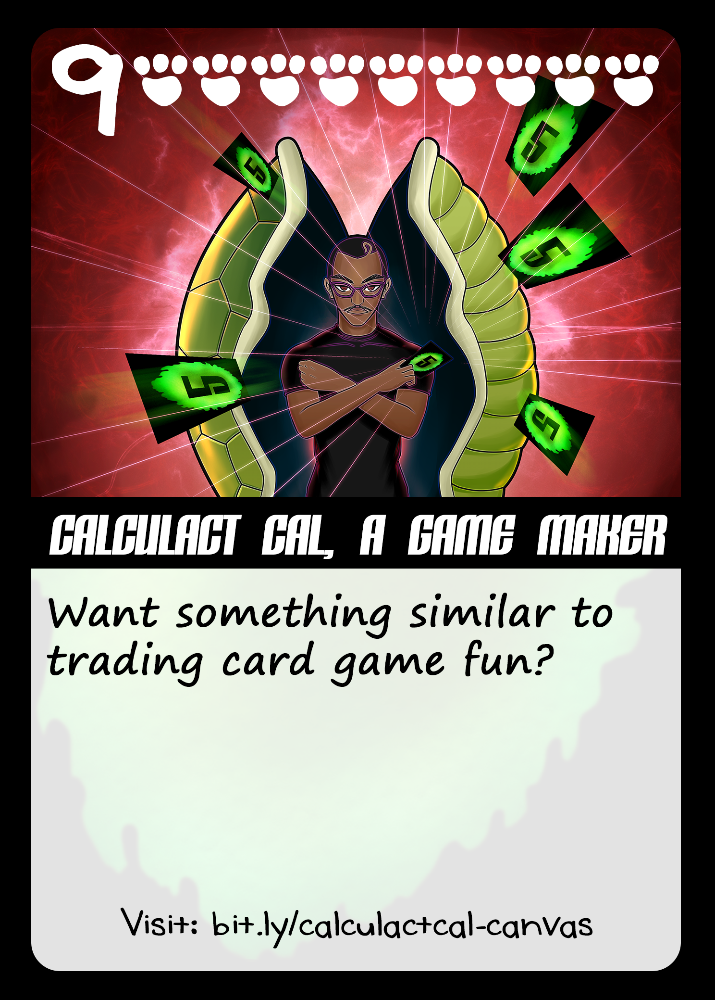

Be inspired by  Calculact Cal, an artist that has ventured into Card Game Design. Check out [calcucatcal.org](https://calcucatcal.org)

**Hi, glad to have you! Please introduce yourself!**

> I have so much to say but I will get to the point. I am Rashaun "Calculact Cal" Smith. I describe myself as being both an intellectual and an artist. That being I created a kind of Card Mind Game (CMG) that appeals to both the artist and his mind. It's simply called "5gamecards".

 

 **When did you start making art?**

> I started making art because of my friends because I loved my friends. We would draw, paint and share art amongst each other personally. After we became more busy with life, we drifted apart from making art.

  

**Which piece or series are you most proud of and why? Is there a story behind it?**

> If there was any piece of art I am most proud of I would say it's all the art pieces I gave to my friends. The bonus of me making art today is that I can make more of those memories again with my friends through painting and playing my CMG with them.

  

**What would you say is your main source of inspiration?**

> For my art, my main source of inspiration is nature and being around people.
> For creating my Card Mind Game, my main source of inspiration was being in and out the mental hospital.

 

**What are some of your favorite artist tools & does your workflow look like?**

> Before my CMG my favorite tool was pen and paper. After that I want my Card Mind Game to be my favorite art tool. For me and for everybody.

**What are some pieces of advice you have for other artists?**

> My advice to artists out there is that art is really valuable. Look at all the cool stuff they do with art in the world. From animation to cgi, architecture and sketch art, even the irs and other governments hold onto art because they know art has value outside of money alone. I would say make art based on what's happening in the world around you and make it fun. In that way art can be a positive friendly escape for all of us!

Thanks for reading! Be sure to go check out Calculact Cal's work!