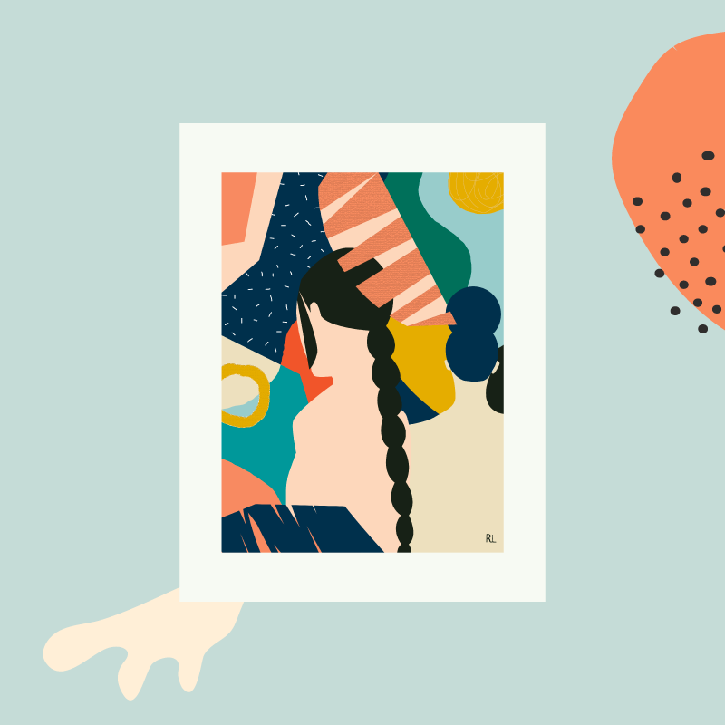
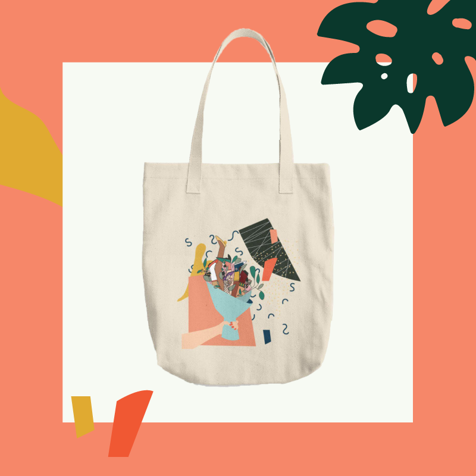

An interview with the illustrator and designer from LA, Yuhan Liu!

Consider checking out her work on her [instagram: @yuhanliu.design](https://www.instagram.com/yuhanliu.design/ ).

##### **Hi, glad to have you! Please introduce yourself!**

> Yuhan Liu is an LA-Based creative, specializing in identity design and illustration. Inspired predominantly from nature and the surrounding environments, Rita’s work is playful and vibrant, and nostalgic. She loves touching everything she sees, because of that she often uses natural elements she found in her work because art should be playful and touchable.

 

##### **When did you start making art? What does art offer you?**

> I start making art 7 years ago, and I fell in love with it right away because I had no patient doing anything until I start doing art. It really calms me down and helps my mind to concentrate.

 

##### **Which piece or series are you most proud of and why? Is there a story behind it?**

> I attached the series of A day of my life to this message, this is about a girl's daily routine. I think art should be approachable, related to people's life.

 

##### **What would you say is your main source of inspiration?**

> I'm inspired predominantly from nature and the surrounding environments and people around me

 

##### **What are your favorite artist tools? What does your workflow look like?**

> I like to do oil painting or using procreate. Illustrator for my digital work.

##### **What are some pieces of advice you have for other artists?**

> Art should be personal, the most important thing is not about how good technique you have ( don't get me wrong, the technique is important too!), is about how you express your personal feeling and how people related to that.

Thank you for reading! Please consider checking out Yuhan Liu's work.