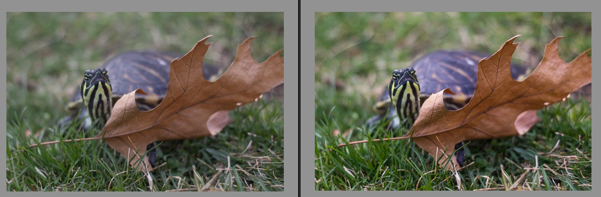

Learn the benefits and definition of RAW photography and how to implement it into your photography workflow. 

*You do not need all this gear lol but it*

## What is RAW photography?

A few RAW photography basics to get us started.  You may be wondering what a RAW photo file is, and that's a great question!

RAW photography files are an image file format for **uncompressed** images. All the data from your camera sensor is present. This means there are big files, and you might need to invest in an [external hard drive.](https://amzn.to/2CS0WSp) They aren't too expensive anymore, thank goodness. 

If you want a lot of detail, read this in depth article about the [RAW image format.](https://en.wikipedia.org/wiki/Raw_image_format) 

Here's a RAW photography before and after shot to show you the capabilities of the RAW format:

*My turtle modeling the awesome powers of RAW*

This example is a bit tame, and I stayed to mostly minimal edits,  but I enjoy developing my photos and having flexibility in terms of exposure and color. 

* Fun fact: What does the RAW acronym stand for? It's not an acronym at all. It's just RAW, as in raw like uncooked – and that's what it is! 

## RAW Photography Pros and Cons

### RAW photo advantages

- The RAW photo format offers you complete, unmodified data from your camera sensor. Lots of room to edit photos without a loss in quality. 
- Due to the previous point, your photos are very flexible because you can edit them losslessly and change a lot of things, without degrading  the image as you edit. You can export as many times as you want, instead of a JPG where you might want to work off a copy, to prevent your original photo from degrading even further. 
- You can push dynamic range, colors, and highlights in a way that looks better than the default JPG that comes straight out of the camera. This is because you are a human and can often develop images that look better than an algorithm. Don't get me wrong though, JPGs that come out of today's cameras are quite beautiful!

###  RAW photo disadvantages 

- You will need something to view the photos with, a raw photo viewer. 

  Most computers and phones these days ship with photo viewers that allow you to view RAW photos. You might need to download one, but go for a free one. 

  I have an article with all my favorite art and [photography software](https://artres.xyz/post/fantastic-free-and-open-source-software-programs/).  

- A RAW File takes up more space than a compressed JPG, by quite a lot. One of my RAW photos is 22.2 MB, while the JPG is only 4 MB. The raw photo size can be an issue if you are limited on disc space. 

- Because of the larger file size, the camera often writes slower, and thus the amount of  burst images you can take in one go will be less, since the buffer fills faster. 

- Takes more time to process RAW files.

## When to shoot RAW

In my opinion, RAW photography is great for slower subjects and artistic set ups. 

- Macro - and RAW + focus stacking. = gold
- Portrait
- Commercial
- Landscape
- Photomanipulation stock / textures

It's optimal for controlled shots where you do not need to rely on burst mode too heavily. 

Not as good for action or sports, since you need to be able to capture quickly and in rapid succession. However, if you are amazing at capturing at the right time, of course try RAW!

## Raw Photo Processing Software

When designing your RAW photography workflow, you need to find editing software that can develop RAW photos. Which raw photo software is best? It depends on what you're looking for.  Here are my recommendations of good raw photo editors. Try them out and see which one suits your style the best.

### Free

- [RawTherapee](https://rawtherapee.com/) - wonderful open source software project 
  Cross platform ( Linux, macOS & Windows) & multi language.
- [darktable](https://darktable.org/) - “Open source photography workflow software and raw developer ""
   Linux, macOS & Windows
- [digikam](https://www.digikam.org/) - free and open source image organizer, works well with other apps. 
- Built in raw photo viewer for mac and windows. I am pretty sure that you can at least view them, last time I checked. 
- The one bundled with your DSLR if applicable. 

## Paid

- [Affinity Photo](https://affinity.serif.com/en-us/photo/ipad/) - very capable and inexpensive, with a lot of great functionality. Does not have the catalog options like Lightroom, but can be paired with other software 
  - [mac](https://itunes.apple.com/us/app/affinity-photo/id824183456?mt=12) & [windows](https://affinity.store/buy/windows/photo/)
- [Adobe Lightroom](https://lightroom.adobe.com) - I am currently using version 5, which was around $100, so not too bad. A great option with cataloging features and wonderful algorithms. 
- [Pixelmator](https://itunes.apple.com/us/app/pixelmator/id924695435?mt=8) -A very nice option for [mac](https://itunes.apple.com/us/app/pixelmator/id407963104?mt=12). Lots of features and optimizations. 

There are definitely more options, but these raw photo converter  options should be enough to get you started! Let me know if you have any specific favorites. 

## Workflow

There is a bit of a process involved for editing raw photos, but here is what I tend to do. It's a pretty simple workflow on how to edit a raw photo. 

1. Switch camera to shoot RAW. If you want a copy you can share with others quickly, try RAW + JPG. That takes hella space, but is convenient for many usage cases. 

2. Get your images off the camera's SD card and onto your computer. If you are wondering which files are the raw photo files, look up your camera manufacture's manual or google it. For my Canon camera, the image extension is .CR2 and for Sony it is .ARW. 

   1. Make sure that you figure out a sound organization system before you end up with a folder mess. I recommend fewer folders, and perhaps a good tagging system.
   2.  I have a RAW folder, a JPG library folder, and a Share Export folder. This keeps things mostly organized without having ten thousand layers of folders that I won't use. Most photo viewers have view by date built in, so I don't need that anyways. 

3. Start editing your files! Honestly, I first recommend you experiment. I also recommend not overdoing it with the sliders. Less is more, most of the time. Too much sharpening and contrast often results in a garish looking photo. Balance is key. 

4. To make your life easier, create a standard import preset in whatever program you are using.  This gets automatically apply to all my pictures, and then I can adjust from there. 

   1. Mine is pretty minimal, and here are my settings for Lightroom:
      - Exposure: + .15 I usually slightly underexpose my photos so I can avoid clipping highlights and then boost the shadows. 
      - Contrast: + 10 (this is a small amount)
      - Highlights: - 3
      - Shadows: + 37
      - Whites: + 17
      - Blacks: - 15
      - Clarity: + 13
      - Vibrance: + 21 Vibrance boosts saturation selectively. This is nice because it doesn't result in overdone colors. 
      - A very gentle curve adjustment. of + 4 lights and - 4 darks. I usually manually push this setting so I have a gentle S curve.
      - Sharpening – Amount: 63, radius: 1.4, detail: 12, masking: 20. I tweaked this after looking up recommended settings, and I think it looks pretty natural. 
      - Noise reduction– color: 25, detail: 25. I probably should adjust this for luminance.

5. Find the setting that allows you to view if any highlights and shadows are clipped. Fix those with your RAW editing software, and enjoy that you can easily do that! JPGs often delete that info, so it's much harder to recover a photograph that was exposed less than ideally. 

6. Export your raw photo to jpeg for sharing on social media and the web! You can also set up an archival system with TIFF and all of that, but I don't personally since I don't find myself needing that. 

   If you need more specific tips, let me know! I might make a video one day. :D

   ​

## Further reading:

I hope this guide was useful!

